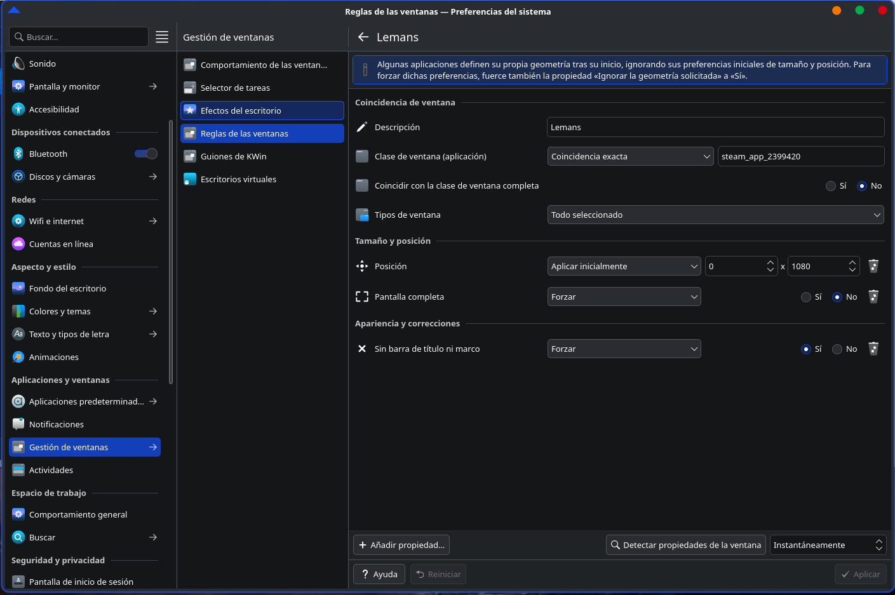

# LMU SimHubDash CrewChief Linux Triple Monitor Guide

Complete guide for setting up Le Mans Ultimate on Linux with SimHubDash and CrewChief, including triple monitor configuration (7680×1440).
Guía completa para configurar Le Mans Ultimate en Linux con SimHubDash y CrewChief, incluida la configuración de triple monitor (7680×1440).

---

## 📸 Screenshots

### SimHubDash Dashboard

### Triple Monitor Setup

### Window Rule KDE Plasma

---

## 🌍 Languages

- 🇪🇸 Spanish guide → `Spanish/`
- 🇬🇧 English guide → `English/`

---

## ⚠️ Notes

- Tested on CachyOS + KDE Plasma
- Wayland setup
- No Gamescope required
